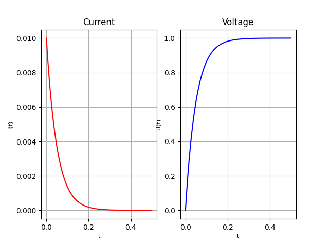

# Код программы
```python
import math
import matplotlib.pyplot as pyplot

# Параметры моделирования
timeLine = []
for i in range(0, 500):
    timeLine.append(i / 1000)

# Параметры цепи (в СИ)
E = [1, 10, 10]
R1 = [100, 100, 2]
R2 = [0, 0, 2000]
C = [0.0005, 0, 0.00047]
L = [0, 5, 0.047]


def start(mode):
    if mode == 1:
        U, I = task1(E[mode - 1], R1[mode - 1], R2[mode - 1], C[mode - 1], L[mode - 1])
    elif mode == 2:
        U, I = task2(E[mode - 1], R1[mode - 1], R2[mode - 1], C[mode - 1], L[mode - 1])
    elif mode == 3:
        U, I = task3(E[mode - 1], R1[mode - 1], R2[mode - 1], C[mode - 1], L[mode - 1])

    printGraph(1, "Current", I, timeLine, color="red")
    printGraph(2, "Voltage", U, timeLine, color="blue")
    pyplot.show()


def task1(E, R1, R2, C, L):
    U = []
    I = []
    for i in range(len(timeLine)):
        U.append(E * (1 - math.exp(-timeLine[i] / (R1 * C))))
        I.append((E / R1) * math.exp(-timeLine[i] / (R1 * C)))
    return U, I


def task2(E, R1, R2, C, L):
    U = []
    I = []
    for i in range(len(timeLine)):
        U.append(E * (1 - math.exp(-R1 * timeLine[i] / L)))
        I.append((E / R1) * math.exp(-R1 * timeLine[i] / L))
    return U, I


def task3(E, R1, R2, C, L):
    U = []
    I = []


    discriminant = 1 - (4 * C * L * R2 * (R1 + R2)) / (L + R1 * R2 * C)

    if discriminant >= 0:
        # Апериодический режим
        sqrt_term = math.sqrt(discriminant)
        A2 = -((E * R2) / (C * L * (R1 + R2))) * (
                1 + (L + R1 * R2 * C) / (2 * C * L * R2) * (
                1 + sqrt_term
        )
        ) / (2 * sqrt_term)

        A1 = -A2 - E * R2 / (C * L * (R1 + R2))

        for i in range(len(timeLine)):
            t = timeLine[i]
            U_t = (
                    A1 * math.exp(-(L + R1 * R2 * C) / (2 * C * L * R2) * (1 + sqrt_term) * t) +
                    A2 * math.exp(-(L + R1 * R2 * C) / (2 * C * L * R2) * (1 - sqrt_term) * t) +
                    (E * R2) / (C * L * (R1 + R2))
            )
            U.append(U_t)

            I.append(0)  # Заглушка

    else:
        # Колебательный режим
        sigma = (L + R1 * R2 * C) / (2 * C * L * R2)
        omega = math.sqrt(-discriminant) * (L + R1 * R2 * C) / (2 * C * L * R2)

        # Упрощенное решение для колебательного режима
        U_steady = E * R2 / (R1 + R2)

        for i in range(len(timeLine)):
            t = timeLine[i]
            # Затухающие колебания
            U_t = U_steady * (1 - math.exp(-sigma * t) * math.cos(omega * t))
            U.append(U_t)
            I.append(0)  # Заглушка


    return U, I


def printGraph(num, title, y, x, color):
    pyplot.subplot(1, 2, num)
    pyplot.grid(True)
    if title == 'Current':
        pyplot.ylabel('I(t)', fontsize=8)
        pyplot.xlabel('t', fontsize=8)
    if title == 'Voltage':
        pyplot.ylabel('U(t)', fontsize=8)
        pyplot.xlabel('t', fontsize=8)

    pyplot.plot(x, y, color=color)
    pyplot.title(title)


start(3)
```
# Результат
## Задача 1

## Задача 2

## Задача 3
